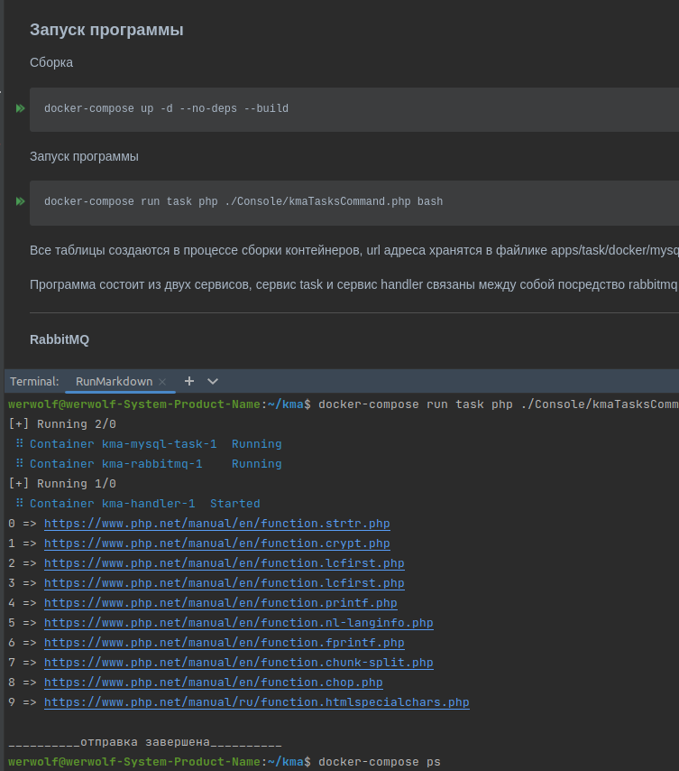

### Запуск программы
Сборка 
```shell
docker-compose up -d --no-deps --build
```

Запуск программы
```shell
docker-compose run task php ./Console/kmaTasksCommand.php bash
```


Все таблицы создаются в процессе сборки контейнеров, url адреса хранятся в файлике apps/task/docker/mysql/dump/init_data/urls.csv, после того как контейнеры будут собраны из файлика данные будут залиты в базу

Программа состоит из двух сервисов, сервис task и сервис handler связаны между собой посредство rabbitmq шины + папка /vendor, подключается как библиотека



----

##### RabbitMQ
Подключение к rabbit:
host: http://127.0.0.1:15673 
user: admin
password: 1234
----

##### MYSQL
Подключение к базе:
```shell
docker-compose exec mysql-task  mysql -u admin -p1234;
```
Вывести сколько строк за минуту
```shell
docker-compose exec mysql-handler  mysql -u admin -p1234 app --batch --silent -e \
"SELECT DATE_FORMAT(c.created_at, \"%H:%i\") AS minute, count(content) AS total FROM app.content c GROUP BY DATE_FORMAT(c.created_at, \"%Y-%m-%d %H:%i\");"
```
Вывести минуту группировки
```shell
docker-compose exec mysql-handler  mysql -u admin -p1234 app --batch --silent -e \
"SELECT DATE_FORMAT(c.created_at, \"%i\") FROM app.content c GROUP BY DATE_FORMAT(c.created_at, \"%Y-%m-%d %H:%i\");"
```
Вывести среднюю длину контента
```shell
docker-compose exec mysql-handler  mysql -u admin -p1234 app --batch --silent -e \
"SELECT AVG(content) FROM app.content;"
```
Вывести когда было сохранено первое сообщение в минуте и последнее
```shell
docker-compose exec mysql-handler  mysql -u admin -p1234 app --batch --silent -e \
"SELECT min(created_at) AS first, max(created_at) AS last FROM app.content c GROUP BY DATE_FORMAT(c.created_at, \"%Y-%m-%d %H:%i\");"
```

----

##### CLICKHOUSE

Подключение к базе: 
```shell
docker-compose exec clickhouse-server clickhouse-client --user admin --password 1234
```
Вывести сколько строк за минуту
```shell
docker-compose exec clickhouse-server clickhouse-client --user admin --password 1234 \
--query="SELECT formatDateTime(c.created_at, '%Y-%m-%d %H:%M') AS minute, count(content) AS total FROM app.content c GROUP BY formatDateTime(c.created_at, '%Y-%m-%d %H:%M');"
```

Вывести минуту группировки
```shell
docker-compose exec clickhouse-server clickhouse-client --user admin --password 1234 \
--query="select formatDateTime(parseDateTime32BestEffort(t.minute), '%M') from (SELECT formatDateTime(c.created_at, '%Y-%m-%d %H:%M') AS minute, count(content) AS total FROM app.content c GROUP BY formatDateTime(c.created_at, '%Y-%m-%d %H:%M')) t;"
```

Вывести среднюю длину контента
```shell
docker-compose exec clickhouse-server clickhouse-client --user admin --password 1234 \
--query="SELECT AVG(content) FROM app.content;"
```

Вывести когда было сохранено первое сообщение в минуте и последнее
```shell
docker-compose exec clickhouse-server clickhouse-client --user admin --password 1234 \
--query="SELECT min(created_at) AS first, max(created_at) AS last FROM app.content c GROUP BY formatDateTime(c.created_at, '%Y-%m-%d %H:%M');"
```